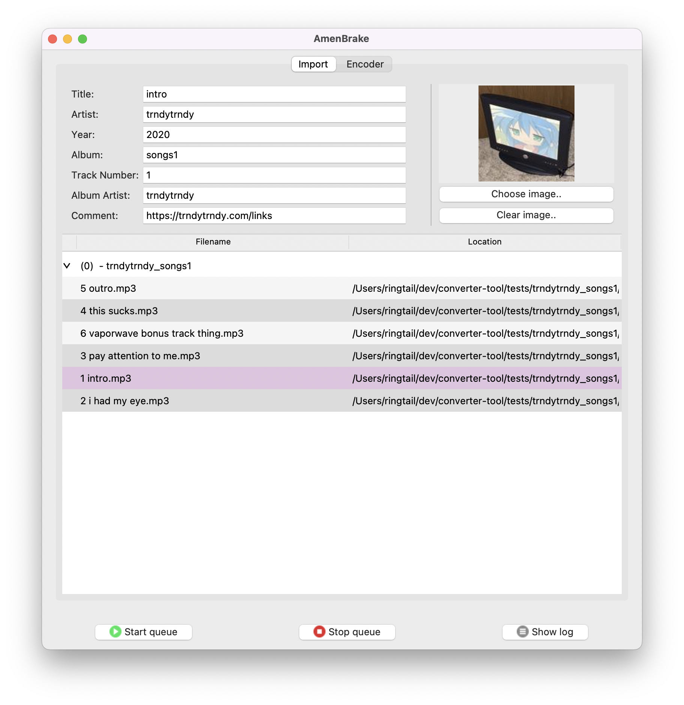

# AmenBrake

A simple audio transcoder and metadata editor.

----------------

## Table of contents

- [About](#about)
- [Requirements](#requirements)
- [Download](#download)
- [FAQ](#faq)
- [Known sssues](#known-issues)
- [Report a bug](#report-a-bug)
- [Contributing](#contributing)
- [Support this project](#support-this-project)

----------------

## About

AmenBrake is a python based GUI wrapper for ffmpeg that allows you to transcode batches of audio files and edit or add metadata and cover art.

----------------

## Motivation

With Bandcamp's future seeming uncertain at the moment, i wanted to upload my music somewhere else as a backup alternative so that even if Bandcamp suddenly disappears, people can still download my music. I decided on using itch.io as my alternative of choice since it was very customizable, however, specifically for music, there was one big draw back. A slightly underrated feature of Bandcamp is the ability to download a purchased item in a selection of different formats (flac, mp3, wav, etc.), which is super convenient. itch.io does not have that feature, what you upload is what will be downloaded.

This of course was going to be an issue, since all my masters are wav files, which dont allow for metadata or cover art and are quite large, so i would have to transcode and add metadata to a *lot* of files, something that would be tedious to do with a program like audacity. So thats why i created this program, to make the process of transcoding and adding metadata to batches of audio files much more simple and streamlined, similar to something like HandBrake (hence the name!)

----------------

## Requirements 
- ``python@3.12``
- ``python-tk@3.12``
- ``ffmpeg``

To install dependencies, run ``pip install -r requirements.txt``

----------------

## Download

work in progress

----------------

## FAQ

- ### "No ffmpeg installation found!"
    You dont have a valid installation of ffmpeg on your system, please install ffmpeg. If you have installed ffmpeg and this still persists, please be sure to check if your installation is working by running ``ffmpeg --version`` in a terminal or command prompt. If the install is valid and this issue is still happening, please submit an issue.

----------------

## Known issues

- The UI layout can be a bit buggy at times

----------------

## Report a bug

work in progress

----------------

## Contributing

work in progress

----------------

## Support this project

work in progress
